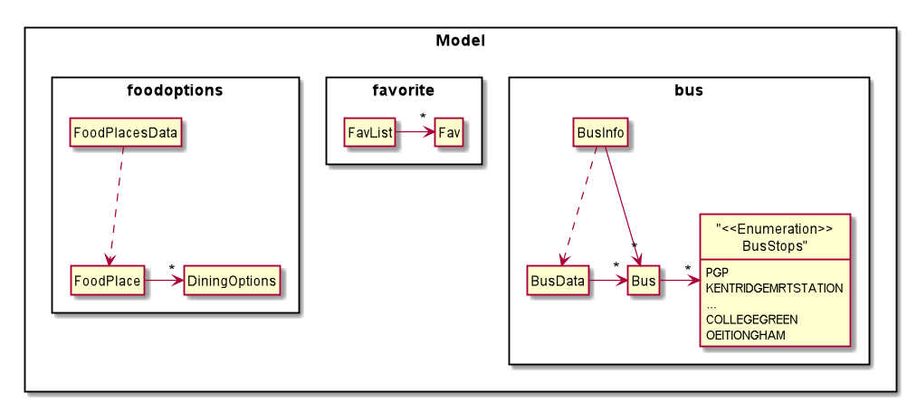
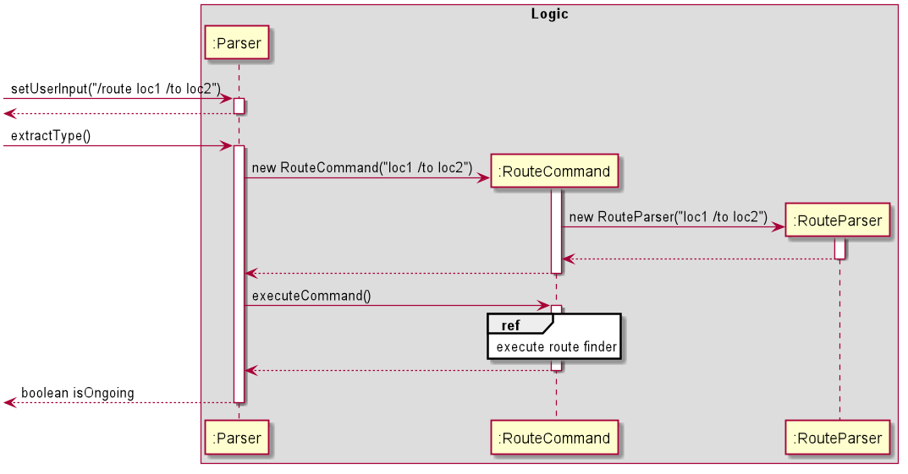
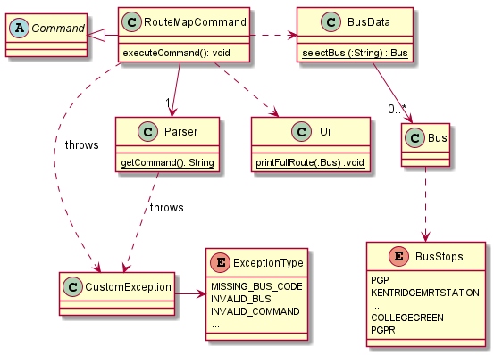
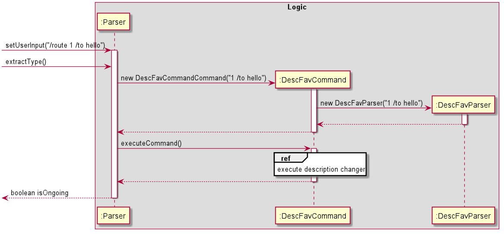
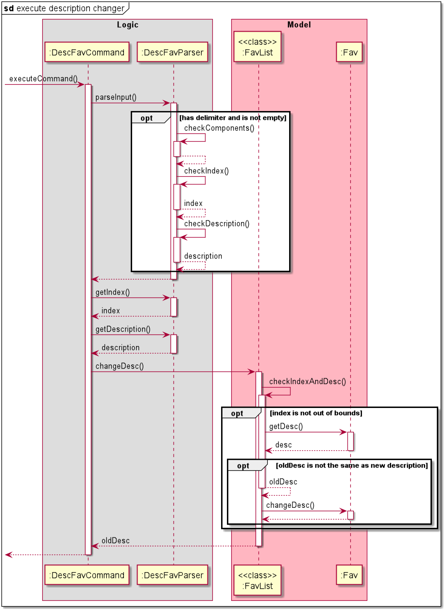
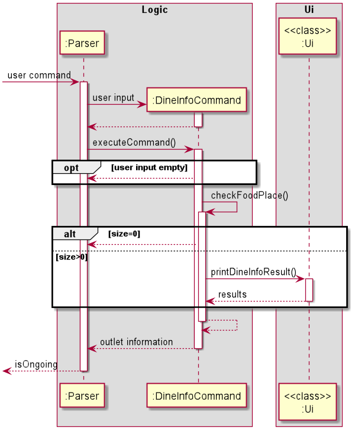

# Developer Guide

This developer guide aims to provide an overview of Nav@NUS to aid developers in creating extensions or making 
enhancements.

## Table of Contents

- [1. Setting up, getting started](#1-setting-up-getting-started)
- [2. Design](#2-design)
  * [2.1. Architecture](#21-architecture)
    + [2.1.1 Ui Component](#211-ui-component)
    + [2.1.2. Logic Component](#212-logic-component)
    + [2.1.3. Model Component](#213-model-component)
    + [2.1.4. Storage Component](#214-storage-component)
- [3. Implementation](#3-implementation)
  * [3.1. Direct Route Finder (`/route` Feature)](#31-direct-route-finder-route-feature)
  * [3.2. Full Route Display (`/routemap` Feature)](#32-full-route-display-routemap-feature)
  * [3.3. Favourite command adder (`/addfav` Feature)](#33-favourite-command-adder-addfav-feature)
  * [3.4. Favourite command executor (`/execfav` Feature)](#34-favourite-command-executor-execfav-feature)
  * [3.5. Favourite command description modifier (`/descfav` Feature)](#35-favourite-command-description-modifier-descfav-feature)
  * [3.6. Dining options finder (`/dine` Feature)](#36-dining-options-finder-dine-feature)
- [4. Appendix I: Requirements](#4-appendix-i-requirements)
  * [4.1 Product scope](#41-product-scope)
    + [4.1.1 Target user profile](#411-target-user-profile)
    + [4.1.2 Value](#412-value)
  * [4.2. User Stories](#42-user-stories)
  * [4.3. Non-Functional Requirements](#43-non-functional-requirements)
  * [4.4. Glossary](#44-glossary)
- [5. Appendix II: Instructions for manual testing](#5-appendix-ii-instructions-for-manual-testing)

## 1. Setting up, getting started

Refer to the guide [Setting up and getting started](https://github.com/AY2021S1-CS2113T-F14-3/tp/blob/master/README.md#duke-project-template).

## 2. Design

This section describes the design and implementation of the product. It has been divided into two sections: Architecture 
and Implementation. 

### 2.1. Architecture

The architecture diagram given in the figure below explains the high-level design of the App. 

Given below is a quick overview of each component.

`Main` is the class Duke.java. It is responsible for:

- Initializing the components in the correct sequence, and calling or creating objects in the order of execution.

The rest of the App consists of 4 main components:

- `Ui` : The Ui component handles all interactions with the user.
- `Logic` : The Logic component makes sense of the command and executes it.
- `Model` : The Model component is responsible for all data held in the memory.
- `Storage` : The Storage component handles data by reading from and writing to files in the hard disk. 

The sections below give more details of each component.

#### 2.1.1 Ui Component
The Ui component is responsible for getting the user input and for displaying appropriate messages as response 
to commands executed by the logic component. The following class diagram gives a brief overview of the Ui component 
and it's interaction with other components.

#### 2.1.2. Logic Component
The Logic component is responsible for the following tasks:
- Makes sense of the command entered by the user by splitting it into the command type and the parameters and/or 
delimiters if any.
- Executes a command based on its type and provides an appropriate result to the user via the Ui component.

The following class diagram briefly explains how different classes in the Logic component interact with each other.

#### 2.1.3. Model Component
The Model component is responsible for the following tasks:
- Stores the bus data, dine info data and favourites list in memory.
- Performs operations on the data to facilitate the command execution by Logic component.

The following class diagram briefly explains how different classes in the Model component interact with each other.

#### 2.1.4. Storage Component
The Storage component is responsible for the following tasks:
- Stores the favourite commands in a file in a certain format and retrieves this information everytime 
the user enters the application.
- Stores the number of times each bus stop has been typed by the user since he/she started using the application and 
retrieves it everytime the user enters the application.
    + This information is used to find out the user's most frequently searched location so far and display it to the 
    user. 
- These files are updated after every execution of a user command.

The following class diagram briefly explains how different classes in the Storage component interact with each other.

## 3. Implementation
This section provides details of how the main features of Nav@NUS have been implemented.

### 3.1. Direct Route Finder (`/route` Feature)

`/route <location1> /to <location2>` is the command that has to entered by the user to see all direct bus routes 
available from **location1** to **location2**.

The class diagram in the figure below shows how different classes used for implementation of the `/route` command 
are linked to each other. 

The `RouteCommand#executeCommand()` method of RouteCommand Class executes the command in the following steps:
1. Calls `RouteParser#getLocations()` to get the locations entered by the user in the order of starting location and 
destination.
    - The `RouteParser#getLocations()` method throws an exception if the locations or the delimiter `/to` is missing.
2. Calls `RouteCommand#checkLocations()` to make sure location strings are not empty or the same.
    - The `RouteCommand#checkLocation()` method throws an exception if locations are empty or the same.
3. Calls `RouteCommand#similarityCheck()` to check if the locations are not in the list of bus stops but 
are similar.
    - The `RouteCommand#similarityCheck()` method calls the static `SimilarityCheck#similarLoc()` method and returns 
    a list of similar locations, if any.
    - If the list of similar locations is empty, `RouteCommand#executeCommand()` performs step 4 given below, 
    else it calls the static method, `Ui#printPossibleLocsMessage()`, to print the list of similar locations. 
4. Calls static `BusData#possibleBuses()` to get a list of buses with their routes from the starting location to 
the destination.
   - `BusData#possibleBuses()` calls `Bus#getPossibleRoute()` to check for a possible route for the given bus number.
   - `BusData#possibleBuses()` repeats this call for all bus numbers.

The following sequence diagram explains the above steps when the user enters `/route loc1 /to loc2`.

The following sequence diagrams explain the interactions omitted in the main diagram.

### 3.2. Full Route Display (`/routemap` Feature)

The `/routemap <bus code>` is the command that has to entered by the user to see the full bus route of a user-specified
bus route.

The class diagram in the figure below shows how different classes used for implementation of the `/routemap` command 
are linked to each other.

The `RouteMapCommand#executeCommand()` method of RouteMapCommand Class executes the command in the following steps:
1. Calls `BusData#selectBus()` to find the user-specified bus in the bus data list. If found, the Bus object will be 
returned. Else, null is returned.
2. Calls `Ui#printFullRoute()` to display full route of the specified bus.

The following sequence diagram explains the above steps when the user searches for the full route of a bus.

### 3.3. Favourite command adder (`/addfav` Feature)
The `AddFavCommand#executeCommand()` method of AddFavCommand Class executes the command in the following steps:
1. The `RouteParser#executeCommand` method throws an exception if the command to be saved in FavList is missing.
2. Calls `AddFavCommand#createFav()` to make a new Fav object to be saved in the FavList.
    - The `AddFavCommand#createFav()` method creates a Fav object with its command saved as its description if 
    the user left description empty.
3. Calls `AddFavCommand#addToFavList()` method to add the Fav object created to the Favlist.
    - The `AddFavCommand#createFav()` method calls the contains method within Favlist to check for any duplicate
    Fav objects within the list that contains the same command.
    - If the there are no duplicate Fav objects, Fav object created will be added to the FavList.

`/addfav <description>` is the command that has to be entered by the user to add a previous valid command in to the user's
list of favourites.

The following sequence diagram illustrates the steps taken by the program when the user calls the `/addfav` command.

### 3.4. Favourite command executor (`/execfav` Feature)
[Work in Progress] 
`/execfav <INDEX>` is the command which executes a command from the user's list of favourites

The following sequence diagram illustrates the steps taken by the program when the user calls the `/execfav` command.

### 3.5. Favourite command description modifier (`/descfav` Feature)

`/descfav <index> /to <newDescription>` command allows the user to change the current description of their favourite command
at location **index** in the list to **newDescription**.

>Note: **index** is the index of the item in the list when the first number is indexed as 1. As a result, 
>we access this element in the ArrayList using **index** - 1.

The class diagram in the figure below shows how different classes used for implementation of the `/descfav` command 
are linked to each other. 

The `DescFavCommand#executeCommand()` method of DescFavCommand Class executes the command in the following steps:
1. Calls `DescFavParser#parseInput()` to check if the command message input by the user is valid.
    - Throws an exception if 
        + the input is empty.
        + the delimiter `/to` is missing.
    - Calls `Parser#splitCommands()` to separate the **index** and **description**.
    - Checks the validity of each parameter and throws an exception if 
        + both or either of the parameters have only spaces.
        + the given index is not a number.
    - If both inputs are valid, it assigns the input values to index and description variables.
2. Calls `DescFavParser#getIndex()` and `DescFavParser#getDescription()` to get the appropriate values input by the user.
3. Calls static `FavList#changeDesc()` to change the description of favourite at **index**.
    - Calls static `FavList#checkIndexAndDesc()` which throws an exception if **index** is out of bounds or if 
    **description** is the same as the previous description of this favourite.
    - Calls `Fav#changeDesc()` to update the old description to **description**.
    
The following sequence diagram explains the above steps when the user enters `/descfav 1 /to hello`.

The following sequence diagram explains the interactions omitted in the main diagram.

### 3.6. Find dining options within a faculty (`/dine` Feature)

`/dine <faculty>` is the command that has to be entered by the user to see all the dining options available in the 
specified faculty.

The `DineCommand#executeCommand()` method of DineCommand Class executes the command in the following steps:
1. Checks the user input and throws an exception if the input is empty.
2. Calls `DineCommand#checkFaculty()` method to check for a match between the data and user input.
    + Sets the `isFound` parameter to **false** if there is no match.
    + Sets the `isFound` parameter to **true** if there is a match.
        + Calls `Ui#printDineResult()` method to print the matching results.

The following sequence diagram illustrates the steps taken by the program when the user calls the `/dine` command.

### 3.7. Find specific dining outlets (`/dineinfo` Feature)

`/dineinfo <outlet>` is the command that has to be entered by the user to see information of a specified dining outlet.

The `DineInfoCommand#executeCommand()` method of DineInfoCommand Class executes the command in the following steps:
1. Checks the user input and throws an exception if the input is empty.
2. Calls `DineInfoCommand#checkFoodPlace()` method to check for a match between the data and user input.
    + Adds any matching data to an ArrayList `searchList`.
    + Calls `Ui#printDineInfoResult()` method to print the matching results if size of `searchList` is more than 0.

The following sequence diagram illustrates the steps taken by the program when the user calls the `/dineinfo` command.

## 4. Appendix I: Requirements

### 4.1 Product scope

#### 4.1.1 Target user profile

Nav@NUS targets people who are unfamiliar with the shuttle bus service in NUS Kent Ridge Campus 
including students, professors and visitors.
These are people who:
 - needs to be punctual for events such tutorials
 - prefer a desktop CLI app over other types
 - are new to NUS Kent Ridge Campus
  
#### 4.1.2 Value 

Nav@NUS seeks to help the intended audience to achieve the following:
 - Efficient checking of bus routes in NUS
 - Fast viewing of dining options available at other locations
 - Personalised application suited to the user's needs

### 4.2. User Stories

|Version| As a ... | I want to ... | So that ...|
|--------|----------|---------------|------------------|
|v1.0|freshman/ anyone new to nus|know if there is any direct bus to my target destination|I do not need to change buses|
|v1.0|someone that is unfamiliar with the NUS campus|know the full routes of the buses|I could plan my route to my desired destination|
|v1.0|someone new to NUS|know all the available bus stops in the school|I can check the possible bus stops I can board/alight at to reach my destination|
|v1.0|curious person|know the full routes of all the buses in NUS|I can see where each bus is heading to|
|v1.0|freshman/ anyone new to NUS|know the buses available at specific bus stops|I can better plan my trip around the campus in advance|
|v2.0|frequent user|have a list of favourite commands|I can access my favourite commands quickly|
|v2.0|frequent user|be able to customise my list of favourite commands|I can change the list according to my needs|
|v2.0|frequent user|view my most searched bus stop|it can promptly remind me of the bus stop to key in|
|v2.0|frequent user|be able to change how I describe my favorite commands|I know when and why I usually use that command and so that I can use it accordingly later.|

### 4.3. Non-Functional Requirements

1. Nav@NUS should be able to work on any _mainstream OS_ which has Java 11 or a higher version of Java installed.
2. The user is expected to have a basic idea about the places around NUS.
3. A user comfortable with typing english text should be able to find this application faster and more useful than those
that require mouse clicks.

### 4.4. Glossary

* **Mainstream OS** - Windows, Linux, Unix, OS-X

## 5. Appendix II: Instructions for manual testing

{Give instructions on how to do a manual product testing e.g., how to load sample data to be used for testing}
