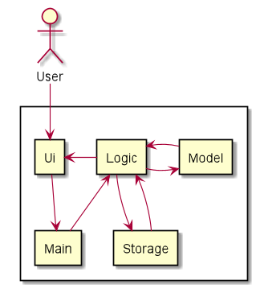

# Developer Guide

This developer guide aims to provide an overview of Nav@NUS to aim developers in creating extensions or making 
enhancements.

- [1. Design & Implementation](#1-design---implementation)
  * [1.1. Architecture](#11-architecture)
  * [1.2. Implementation](#12-implementation)
    + [1.2.1 Direct Route Finder](#121-direct-route-finder)
        * [1.2.1.1. Implementation](#1211-implementation)
- [2. Product scope](#2-product-scope)
  * [2.1. Target user profile](#21-target-user-profile)
  * [2.2. Value proposition](#22-value-proposition)
- [3. User Stories](#3-user-stories)
- [4. Non-Functional Requirements](#4-non-functional-requirements)
- [5. Glossary](#5-glossary)
- [6. Instructions for manual testing](#6-instructions-for-manual-testing)

## 1. Design & Implementation

{Describe the design and implementation of the product. Use UML diagrams and short code snippets where applicable.}

### 1.1. Architecture

The architecture diagram given in figure 1 explains the high-level design of the App. 

<i>
Figure 1: Architecture diagram
</i>

Given below is a quick overview of each component.

## Product scope
### Target user profile

{Describe the target user profile}

### Value proposition

{Describe the value proposition: what problem does it solve?}

## User Stories

|Version| As a ... | I want to ... | So that I can ...|
|--------|----------|---------------|------------------|
|v1.0|new user|see usage instructions|refer to them when I forget how to use the application|
|v2.0|user|find a to-do item by name|locate a to-do without having to go through the entire list|

## Non-Functional Requirements

{Give non-functional requirements}

## Glossary

* *glossary item* - Definition

## Instructions for manual testing

{Give instructions on how to do a manual product testing e.g., how to load sample data to be used for testing}
