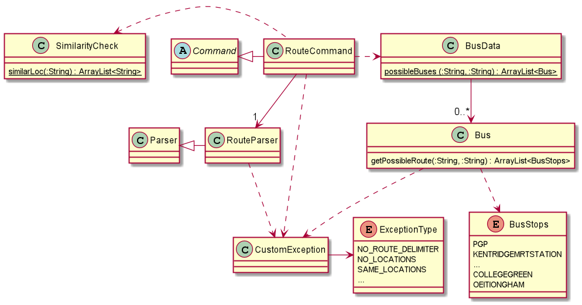

# Developer Guide

This developer guide aims to provide an overview of Nav@NUS to aid developers in creating extensions or making 
enhancements.

- [1. Design & Implementation](#1-design--implementation)
  * [1.1. Architecture](#11-architecture)
    + [1.1.1 Ui Component](#111-ui-component)
    + [1.1.2 Logic Component](#112-logic-component)
    + [1.1.3 Model Component](#113-model-component)
    + [1.1.4 Storage Component](#114-storage-component) 
  * [1.2. Implementation](#12-implementation)
    + [1.2.1 Direct Route Finder](#121-direct-route-finder)
        * [1.2.1.1. Implementation](#1211-implementation)
        * [1.2.1.2. Design Considerations](#1212-design-considerations)
- [2. Product scope](#2-product-scope)
  * [2.1. Target user profile](#21-target-user-profile)
  * [2.2. Value proposition](#22-value-proposition)
- [3. User Stories](#3-user-stories)
- [4. Non-Functional Requirements](#4-non-functional-requirements)
- [5. Glossary](#5-glossary)
- [6. Instructions for manual testing](#6-instructions-for-manual-testing)

## 1. Design & Implementation

{Describe the design and implementation of the product. Use UML diagrams and short code snippets where applicable.}

### 1.1. Architecture

The architecture diagram given in figure 1 explains the high-level design of the App. 

 
<i>
Figure 1: Architecture diagram
</i>

Given below is a quick overview of each component.

`Main` is the class Duke.java. It is responsible for:

- Initializing the components in the correct sequence, and calling or creating objects in the order of execution.

The rest of the App consists of 4 main components:

- `Ui` : The Ui component handles all interactions with the user.
- `Logic` : The Logic component makes sense of the command and executes it.
- `Model` : The Model component is responsible for all data held in the memory.
- `Storage` : The storage component handles data by reading from and writing to files in the hard disk. 

#### 1.1.1 Ui Component

#### 1.1.2 Logic Component

#### 1.1.3 Model Component

#### 1.1.4 Storage Component

### 1.2. Implementation

This section provides details of how the main features of Nav@NUS have been implemented.

#### 1.2.1 Direct Route Finder

The `/route <location1> /to <location2>` is the command that has to entered by the user to see all direct bus routes 
available from *location1* to *location2*.

##### 1.2.1.1. Implementation

The class diagram in figure 2 shows how different classes used for implementation of the `/route` command are linked to
each other. 

 
<i>
Figure 2: Class diagram showing the implementation of the route feature
</i>

The RouteCommand Class executes the command in the following steps:
1. Uses RouteParser to get the locations entered by the user in the order of starting location and destination.
    - The RouteParser throws an exception if the locations or the delimiter `/to` is missing.
3. Uses a method to check if the locations are not in the list of bus stops but are similar.
    - The similarityCheck() method calls the static similarLoc() method of SimilarityCheck class and returns a list of 
    similar locations, if any.
    - If the list of similar locations is not empty, the appropriate Ui function is called, else the steps below are 
    performed.
2. Uses its method to make sure that location strings are not empty or same.
    - The checkLocation() method throws an exception if locations are empty or the same.
3. Calls a method from BusData to get a list of buses with their routes from the starting location to the destination.
   - This method uses another method from class Bus to check for a possible route for the given bus number.
   - Repeats for all bus numbers.

The sequence diagram in figure 3 explains the above steps when the user enters `/route loc1 /to loc2`.

[Work in Progress]

<i>
Figure 3: Sequence diagram showing how the operation works
</i>

##### 1.2.1.2. Design Considerations

[Work in Progress]

## 2. Product scope

### 2.1. Target user profile

{Describe the target user profile}

### 2.2. Value proposition

{Describe the value proposition: what problem does it solve?}

## 3. User Stories

|Version| As a ... | I want to ... | So that I can ...|
|--------|----------|---------------|------------------|
|v1.0|new user|see usage instructions|refer to them when I forget how to use the application|
|v2.0|user|find a to-do item by name|locate a to-do without having to go through the entire list|

## 4. Non-Functional Requirements

{Give non-functional requirements}

## 5. Glossary

* *glossary item* - Definition

## 6. Instructions for manual testing

{Give instructions on how to do a manual product testing e.g., how to load sample data to be used for testing}
